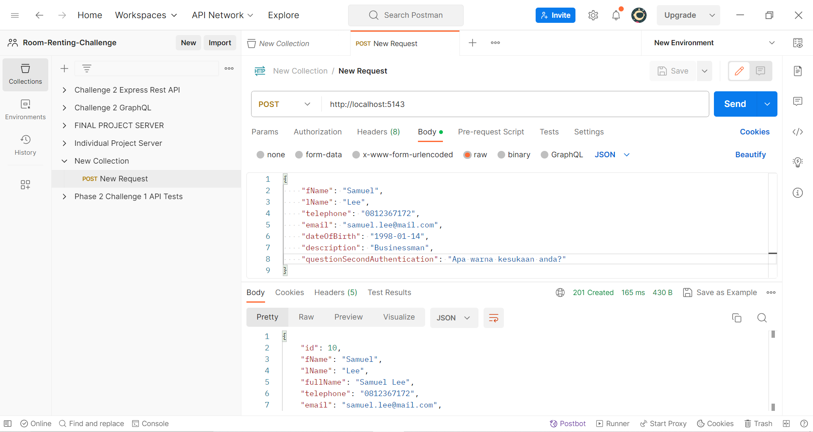

## Rincian Repository ini

Repository ini merupakan tampungan kode untuk sebuah REST API kecil yang melayani data buat berbagai user. REST API hanya melayani dua entrypoint (root directory, atau '/', dan '/:id') dengan empat method (GET, POST, PUT, DELETE).

Tech Stack:
 - .NET Framework v6.0
 - C# Programming Language
 - Database MS SQL Server (LocalDB)
 - Entity Framework (EF) Core (ORM)
 - FluentValidation

### CARA INSTALL

`git clone https://github.com/ValYauw/bank-users-backend.git`

Run perintah ini untuk membuat clone repo di mesin lokal.

`dotnet restore`

Run perintah ini untuk meng-install package dan dependency di .NET framework.

Untuk mengubah application URL di mana REST API ini akan berjalan, maka gantikanlah nilai `applicationUrl` di `Properties/launchSettings.json`. Secara default API entrypoint dilayani di URL `http://localhost:4000`.

`dotnet ef database update`

Run perintah ini untuk melakukan migration database Microsoft SQL Server. Perintah ini membutuhkan .NET tool `dotnet-ef` untuk di-install terlebih dahulu.

Jika database tidak di-seed sebelum applikasi .NET di-run, maka applikasi ini akan secara otomatis menambahkan empat data permulaan untuk development/testing.

`dotnet build` & `dotnet run`

Run perintah ini untuk me-run .NET Web API.

### DEMO POSTMAN



### GET:  `/`

Response - 200 OK

```json
{
    "numPages": 1,
    "data": [
        {
            "id": 1,
            "fName": "John",
            "lName": "Doe",
            "fullName": "John Doe",
            "telephone": "0811111111",
            "email": "john.doe@mail.com",
            "dateOfBirth": "1990-01-01T00:00:00",
            "description": "A businessman",
            "questionSecondAuthentication": "Apakah nama sekolah pertama anda?"
        },
        ...
    ]
}

```

### POST: `/`

Request - Body
```json
{
  "fName": "John",
  "lName": "Doe",
  "telephone": "0811111111",
  "email": "john.doe@mail.com",
  "dateOfBirth": "1990-01-01T00:00:00",
  "description": "A businessman",
  "questionSecondAuthentication": "Apakah nama sekolah pertama anda?"
}
```

Response - 201 Created
```json
{
  "id": 7,
  "fName": "John",
  "lName": "Doe",
  "fullName": "John Doe",
  "telephone": "0811111111",
  "email": "john.doe@mail.com",
  "dateOfBirth": "1990-01-01T00:00:00",
  "description": "A businessman",
  "questionSecondAuthentication": "Apakah nama sekolah pertama anda?"
}
```

Response - 400 Bad Request
```json
{
    "type": "https://tools.ietf.org/html/rfc7231#section-6.5.1",
    "title": "One or more validation errors occurred.",
    "status": 400,
    "errors": {
        "fName": [
            "Nama depan harus diberikan"
        ],
        "telephone": [
            "Nomor telepon harus diberikan",
            "Nomor telephone tidak valid"
        ],
        "email": [
            "Email harus diberikan",
            "Email tidak valid"
        ],
        "dateOfBirth": [
            "Tanggal lahir harus diberikan",
            "Tanggal lahir harus diberikan"
        ],
        "description": [
            "Deskripsi singkat harus diberikan"
        ],
        "questionSecondAuthentication": [
            "Pertanyaan untuk autentikasi kedua harus diberikan"
        ]
    }
}
```

### PUT:  `/:id`

Request - Body
```json
{
  "id": 7,
  "fName": "John",
  "lName": "Doe",
  "telephone": "0811111111",
  "email": "john.doe@mail.com",
  "dateOfBirth": "1990-01-01T00:00:00",
  "description": "A businessman",
  "questionSecondAuthentication": "Apakah nama sekolah pertama anda?"
}
```

Response - 200 OK
```json
{
    "message": "Data telah sukses terupdate"
}
```

Response - 400 Bad Request
```json
{
    "type": "https://tools.ietf.org/html/rfc7231#section-6.5.1",
    "title": "One or more validation errors occurred.",
    "status": 400,
    "errors": {
        "fName": [
            "Nama depan harus diberikan"
        ],
        "telephone": [
            "Nomor telepon harus diberikan",
            "Nomor telephone tidak valid"
        ],
        "email": [
            "Email harus diberikan",
            "Email tidak valid"
        ],
        "dateOfBirth": [
            "Tanggal lahir harus diberikan",
            "Tanggal lahir harus diberikan"
        ],
        "description": [
            "Deskripsi singkat harus diberikan"
        ],
        "questionSecondAuthentication": [
            "Pertanyaan untuk autentikasi kedua harus diberikan"
        ]
    }
}
```

Response - 404 Not Found
```json
{
    "message": "Data tidak ditemukan"
}
```

### DELETE: `/:id`

Response - 200 OK
```json
{
    "message": "Data telah sukses terdelete"
}
```

Response - 404 Not Found
```json
{
    "message": "Data tidak ditemukan"
}
```